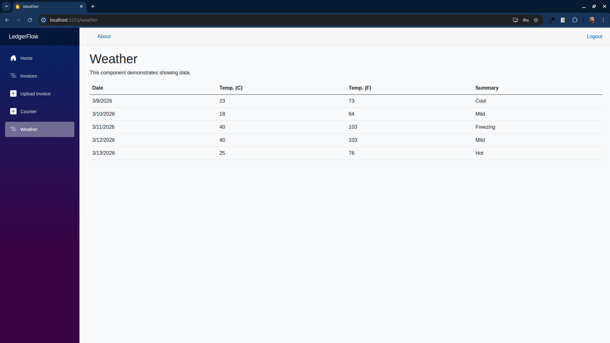

<p align="center">

</p>

# LedgerFlow

**LedgerFlow** is a web-based personal finance and ledger management
application designed to help users track income, expenses, balances, and
financial activity in a clear and structured way.

The goal of the project is to provide a simple, fast, and transparent
financial tracking system that works directly in the browser while
maintaining clean architecture and maintainable code.

LedgerFlow focuses on clarity of financial records, structured
transaction history, and easy navigation of account data.

------------------------------------------------------------------------

## Features

-   ✔️ Account-based financial tracking\
-   ✔️ Record income and expense transactions\
-   ✔️ Running balance calculations\
-   ✔️ Categorization of financial entries\
-   ✔️ Transaction history overview\
-   ✔️ Clean and responsive web interface\
-   ✔️ Structured ledger-style data model\
-   ✔️ Organized project architecture for maintainability

------------------------------------------------------------------------

## Installation & Running

### Prerequisites

-   .NET 8 SDK\
-   Git

### Clone the repository

``` bash
git clone https://github.com/damir-bubanovic/LedgerFlow.git
cd LedgerFlow
```

### Run the application

``` bash
dotnet build
dotnet run
```

The application will start a local web server.\
Open the displayed URL (usually `http://localhost:5000` or
`https://localhost:5001`) in your browser.

------------------------------------------------------------------------

## Project Structure

    LedgerFlow/
    │
    ├─ wwwroot/                → Static assets (CSS, JS, images, screenshot)
    ├─ Pages/                  → Application UI pages
    ├─ Components/             → Reusable UI components
    ├─ Models/                 → Data models
    ├─ Services/               → Business logic and data services
    ├─ Features.md             → Detailed feature description
    ├─ Program.cs              → Application entry point
    └─ LedgerFlow.csproj       → Project configuration

------------------------------------------------------------------------

## How It Works

### 1. Accounts

Users can create and manage financial accounts used to track balances
and transactions.

### 2. Transactions

Transactions record income and expenses and are stored with relevant
metadata such as:

-   amount\
-   category\
-   description\
-   date

### 3. Balance Calculation

LedgerFlow automatically calculates running balances based on recorded
transactions.

### 4. Transaction History

All financial activity is displayed in a chronological ledger-style view
so users can easily review past activity.

------------------------------------------------------------------------

## Example Use Cases

LedgerFlow can be used for:

-   Personal finance tracking\
-   Expense monitoring\
-   Small project budgeting\
-   Simple accounting records\
-   Financial data experimentation for developers

------------------------------------------------------------------------

## Roadmap

Planned improvements for future versions include:

-   Account summaries and dashboards\
-   Advanced filtering and search\
-   Data export (CSV / Excel)\
-   Budget tracking\
-   Authentication and user accounts\
-   Charts and financial visualization

------------------------------------------------------------------------

## Author

**Damir Bubanović**

-   Website: https://damirbubanovic.com\
-   YouTube: https://www.youtube.com/@damirbubanovic6608\
-   GitHub: https://github.com/damir-bubanovic\
-   StackOverflow:
    https://stackoverflow.com/users/11778242/damir-bubanovic\
-   Email: damir.bubanovic@yahoo.com

------------------------------------------------------------------------

## License

MIT License --- free for personal and commercial use.

------------------------------------------------------------------------

## Acknowledgments

-   Built with **.NET 8**, **C#**, and **ASP.NET Core**\
